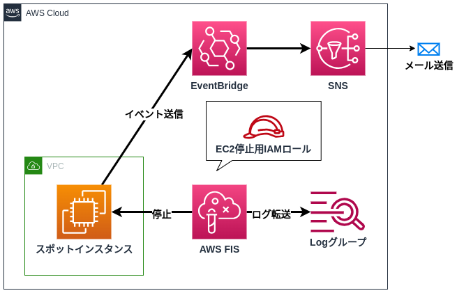

# これはなに？
AWSのFISを使い、スポットインスタンスを停止するチュートリアルです。  
Terraformで停止用のスポットインスタンスを即座に用意出来ます。

# 構成図


# 作成されるリソース
- ネットワーク一式
- スポットインスタンス(one-time)
- FIS用IAMロール
- FIS用CloudwatchLogグループ
- スポット停止通知用eventbridgeルール
- メール通知用SNSトピック、サブスクリプション

※実験テンプレートはawscliで用意します。  
※東京リージョンにリソースが作成されます。

# セットアップ手順
- `envs/dev`にて`terraform apply`
  - 通知用メールアドレスは自身のものを補完すること
- 実験テンプレート`envs/dev/template.json`から実験テンプレートを作成
  - AWSアカウントIDは補完すること

```bash
aws fis create-experiment-template --cli-input-json file://template.json
```

- 作成した実験テンプレートより実験を開始する
- スポットインスタンスが停止すること、CloudWatchLogsグループに実行ログが記録されることを確認する
- スポットインスタンス停止通知がメールで届くことを確認する

# 片付け手順
- `terraform destroy`
- 実験テンプレートの削除

```bash
# テンプレートIDを出す
$ aws fis list-experiment-templates | jq -r '.experimentTemplates[].id'

# テンプレートIDを指定し、削除する
$ aws fis delete-experiment-template --id <ID>
```